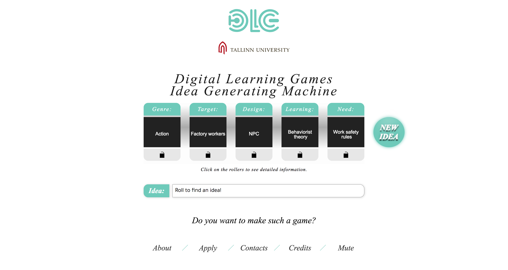

# DLG Reklaammäng

## Screenshot

## Kirjeldus
Mängu eesmärk on genereerida mängijatele mänguidee, selle abil saavad DLG õppekaval õppijad idee, mille abil
hakkavad nad mängu looma. Mänguautomaadil on ka võimalus lukustada omal valikul kuni 3 lahtrit ning nende abil on
võimalik genereerida omale meelepärane idee.
Veebileht on tehtud Tallinna Ülikooli Digitehnoloogiate instituudi üliõpilaste poolt tarkvaraarenduse praktika käigus

## Kasutatud versioonid
- Php: 7.0.33
- HTML: HTML5
- Javascript: ECMAScript 2017
- CSS: CSS Version 4

## Projekti liikmed
- Kertu Kipper
- Krislyn Luks
- Norman Salong
- Kaidi - Liis Liim
- Kristo Roots

## Mängu asukoht

  http://dlg.tlu.ee

## Juhised tabelite jaoks

CREATE TABLE dataGame(
id INT NOT NULL UNSIGNED PRIMARY KEY,
slotContent VARCHAR(64),
slotDesc VARCHAR(512),
slotSentence VARCHAR(256),
active INT(1)
);

CREATE TABLE userData(
id INT NOT NULL UNSIGNED PRIMARY KEY,
username VARCHAR(64),
password VARCHAR(512)
);

## Juhised installeerimiseks

1. Loo MySQL andmebaasis 2 tabelit vastavalt tabelite juhistele.
2. Loo dlgConfig.php fail milles on välja toodud $GLOBALS["$"] muutujatena $servername, $dbusername, $dbpassword, $dbname.
3. Klooni gitis olev kood serverisse, jälgi, et dlgConfig.php fail oleks üks kaust üleval pool koodikaustast ehk: 
juhul kui koodi kaust on server/leht, siis config fail asub server kaustas.
4. Kasutades andmebaasi liidest(domain.com/baasphp) lisa vajalikud andmed andmebaasi, andmete puudumisel ei lae leht ära.

## Litsents

https://github.com/nsalong/dlgSlotMachine/blob/master/LICENSE.txt
